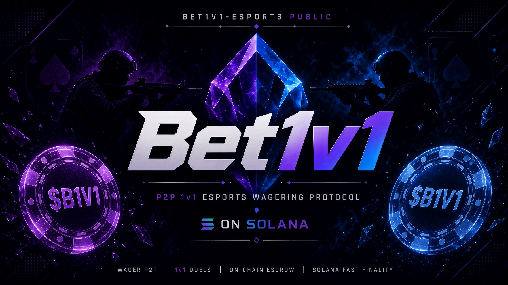

Bet1v1 is a P2P wagering prototype with a Solana escrow program, a TypeScript API, BullMQ settlement workers, a browser dapp, Postgres, Redis, and Quake III/CS2 dedicated-server integrations.

## Local prototype

Copy `.env.example` to `.env`, then run:

```sh
docker compose up --build
```

Open `http://localhost:3000`. The default `MOCK_CHAIN=true` mode lets the dapp simulate token stakes and lets the admin panel publish winner events without a Solana validator or the 60GB CS2 install. Each wallet signs a transaction-free login challenge before it can mutate wallet-owned API state. The admin key defaults to `local-admin`.

The platform starts without an access stake requirement. Wagers can use native SOL or USDC; the example configuration uses [Circle's Solana devnet USDC mint](https://developers.circle.com/stablecoins/usdc-contract-addresses). `TOKEN_MINT` remains the separate optional access-staking token. Set `STAKING_ENABLED=true` to token-gate challenge creation, acceptance, and friend creation. For a real-chain deployment, deploy this program version and initialize its config with both configured mints and the matching `staking_enabled` value; use `update_config` for later toggles. The API rejects mismatched settings. Disabling staking prevents new stakes but always leaves unstaking available for existing deposits.

Set `APP_PORT` if port 3000 is already in use. `VITE_SOLANA_RPC_URL` is compiled into the browser bundle and must be reachable from players' browsers when `MOCK_CHAIN=false`; `SOLANA_RPC_URL` is the separate endpoint used by the API container.

Choose Counter-Strike 2 or Quake III Arena from the arena menu before entering the wager dashboard. Challenges are kept separate by game, and matched wagers receive the corresponding configured server address.

The first authenticated wallet connection requires a unique 3–16 character game username. It is saved to the wallet profile, reused on later visits, and can be changed from Account Settings. Pending Quake challenges adopt the new name; an already-running match keeps its original identity so server events cannot become detached halfway through play.

The normal stack contains:

- `app` on port 3000
- `api` behind the app at `http://localhost:3000/api`
- `worker` consuming BullMQ settlement jobs
- `postgres` on the private Compose network
- `redis` on the private Compose network

## Solana program

The Anchor program supports:

- program configuration with separate admin and rotatable chain-automation authorities, an optional access-token mint, a USDC mint, and required stake
- staking and unstaking for access, with unstaking locked while a wager is active
- public or friend-reserved two-player wagers
- escrow funding by both players
- winner-take-all and incremental settlement signed only by the chain-automation authority
- mutually approved early cash-out of incremental wagers at each player's live balance
- cancellation before an opponent joins
- authority or chain-authority invalidation and refunds after matching
- winner-take-all settlement and participant-funded, configurable incremental payouts
- authority-only bans that slash the full access stake into a treasury token account

SOL stays native: its escrow is held as excess lamports in the program-owned wager PDA. USDC uses an SPL-token vault. Their account contexts and transfer operations remain separate, while shared helpers enforce identical wager terms, access checks, initialization, joining, and active-wager accounting. This avoids wrapped-SOL account creation, synchronization, and close/unwrap edge cases.

Build it with:

```sh
cd bet1v1-solana-program
anchor build
```

### Localnet deployment and end-to-end worker test

The repository includes a reproducible localnet deployment test:

```sh
./scripts/localnet-deploy-and-test.sh
```

It uses `~/.config/solana/id.json` to deploy and initialize the program, and mounts `bet1v1-solana-program/chain-automation-keypair.json` read-only into only the worker container. It starts or reuses a local validator, creates separate local access and USDC mints, initializes the program ungated, and launches an isolated Compose project. The test creates maker/opponent wallets with `solana-keygen`, airdrops local SOL, authenticates both wallets through the HTTP API, saves readable usernames, funds and joins wagers on-chain, posts mocked Quake join/kill events through the API, and verifies worker-signed incremental USDC, winner-take-all SOL, and mutual early-cash-out transfers. The first run resets only `bet1v1-solana-program/test-ledger`; the Compose project name is `bet1v1-localnet-e2e` so unrelated Compose volumes are not touched.

### Devnet deployment and end-to-end worker test

The same flow can deploy and test against Solana devnet:

```sh
./scripts/devnet-deploy-and-test.sh
```

The current devnet deployment is program `8rqv4B1Sw4xweu4kWEHGnqoTQbQvRKuxSturDsz32i4v`, access-test mint `CVigHQj1jh9Zoco7WRp5zjQhaZPfFFpRMgYNAjYJ8gE8`, and six-decimal USDC-test mint `Gm9et15TWqcMgxMoT5XpbuKS3iXiuWvqwdiWUX78VgW`. The USDC-test mint is intentionally controlled by the devnet admin so the automated test can fund fresh wallets; it is not Circle-issued USDC. The script first asks the public devnet faucet for test-user SOL and falls back to explicit admin-wallet transfers when the faucet is rate-limited. It launches an isolated `bet1v1-devnet-e2e` Compose project on port `3003`, with the automation key mounted only into the worker.

Set `WAGER_ID_FLOOR` to reserve a non-overlapping on-chain wager-ID range for each persistent deployment that shares a program ID. The Hetzner template uses `999999`, so its first wager is `1000000`; startup migration only raises the database sequence and never moves it backward.

Use exactly two operational keypairs:

- The admin keypair should be the configured on-chain `authority` and the Solana program upgrade authority (or control the multisig used for both). It can rotate configuration and ban users. Keep it offline and never place it on the app/API host.
- The chain-automation keypair is the configured `chain_authority` and is loaded only by the worker through `CHAIN_AUTHORITY_KEYPAIR` (with `CHAIN_AUTHORITY_SECRET` retained as a fallback). It can settle total wins, pay incremental wins, and invalidate/refund matched wagers, but it cannot change configuration, ban users, or upgrade the program. Fund it only with enough SOL for transaction fees and rotate it with an admin-signed `update_config` if compromised.

The program test suite explicitly verifies that the chain-automation signer cannot update config. The Solana loader owns upgrade authority separately from program state, so deployment operations must set that external authority to the same admin identity and verify it after deployment.

To use the real chain path, set `MOCK_CHAIN=false`, set `USDC_MINT` and `TOKEN_MINT`, provide a funded chain authority with `CHAIN_AUTHORITY_KEYPAIR` (or a JSON/base58 `CHAIN_AUTHORITY_SECRET` fallback), and point `SOLANA_RPC_URL` to the deployed cluster. Rebuild the app so its Vite variables match the RPC and access-token decimals.

## Match settlement flow

The normal result contract is a Redis publication on `cs2:winners`:

```json
{"wagerId":"1","winner":"SolanaWalletAddress"}
```

The API's admin simulator validates that the winner belongs to a matched wager and publishes this event. The API subscriber creates a deduplicated BullMQ job. The worker validates the match again, signs the Anchor `settle_wager` transaction with its dedicated automation keypair, and records the resulting signature in Postgres.

For a real server integration, a CounterStrikeSharp match plugin should publish the same payload only after the final authoritative result. The prototype keeps this boundary mocked because the server image is large and game updates can temporarily break Metamod signatures.

## Q3JS server and automatic settlement

The pinned Q3JS image contains the ioquake3 dedicated server and WebSocket gateway, but it does not redistribute Quake III game data. Place legally obtained `pak0.pk3` through `pak8.pk3` directly in `bet1v1-quake-3-js-server/baseq3`, then run the full stack:

```sh
docker compose --profile bet1v1-quake-3-js-server up -d --build --wait
```

The server runs tournament mode with two slots, frag-only endings, and no time limit. It exposes native Quake traffic on UDP 27960 and its WebSocket gateway and health endpoint on TCP 27961. The dapp opens the external Q3JS browser client with the saved username associated with the connected wallet.

Q3JS posts authenticated `join`, `leave`, and direct-player `kill` callbacks. A small server wrapper also converts the engine's authoritative world/self `Kill:` log lines into authenticated `death` callbacks because upstream Q3JS omits suicides and environmental deaths. The API validates the shared secret and publishes callbacks on `quake3:events`. Its subscriber deduplicates them into the serial `game-events` BullMQ queue. Join events bind the wager's saved username to a Q3 client number. Direct kills require both player identities to match; a world death or suicide requires the victim identity to match and credits the other wager participant.

After each confirmed incremental payout, the worker uses Quake 3 RCON to write one durable `say` message, center-print the payout immediately and again after 2.5 and 5 seconds, and privately `tell` each connected player twice. The short message names the winner once, shows the amount won, and places that winner's live balance first in a compact `winner vs opponent` balance pair. SOL messages include a best-effort USD estimate. Winner-take-all center prints repeat through 10 seconds. A newer scoring event supersedes older pending repeats for that wager so stale amounts cannot reappear. Notifications are sent only after the chain transaction and database update succeed; an RCON delivery failure is logged but never rolls back or retries an already completed money movement. `Q3JS_RCON_PASSWORD` is provided only to the worker and Q3JS server, not the public API or dapp.

The protocol exposes two game-neutral payout modes; the Quake adapter maps authoritative kill events into score increments:

- `WINNER_TAKE_ALL` is the default. A kill callback triggers an ioquake3 UDP `getstatus` query, and the worker settles the full pot only when the authoritative score reaches `QUAKE3_FRAG_LIMIT`.
- `INCREMENTAL` escrows a bankroll from each player and invokes `settle_increment(beneficiary, sequence)` for each verified scoring event. It pays `min(incrementValue, debitedPlayerRemaining)` from the other player's reserve. In a two-player Quake wager, direct kills credit the killer, while suicides and environmental deaths credit the other player. A 100-USDC-unit bankroll with a 5-unit increment can absorb 20 deaths. When one reserve reaches zero, the beneficiary's unused reserve is refunded and the wager closes. This protocol terminology is reusable for other games even though each game adapter decides what constitutes a valid score event.

Either participant in a matched incremental wager can request an early cash-out. The request remains cancellable until the other participant approves it. Approval moves the wager to `CASHING_OUT`, prevents new score jobs from attaching to it, and queues an automation-authority refund. The worker reads the remaining escrow directly from the on-chain wager account, preserves all increments already paid, returns each side's exact live balance, and records the transaction and final split as `CASHED_OUT`.

The Compose deployment intentionally permits only one reserved or active Quake wager because it runs one shared two-slot server. The opponent's off-chain acceptance atomically reserves that server before either wallet is asked to fund escrow; either participant can release an unfunded reservation. The API also verifies the program account after each funding transaction, and the dapp reconciles a previously confirmed transaction instead of asking the wallet to fund it twice if the follow-up API request was interrupted. Horizontal match-server orchestration is required before concurrent Quake wagers are enabled. The chain-automation authority pays one Solana fee per scoring event in incremental mode.

Local Q3JS mode uses a loopback master URL, so heartbeat failures are harmless. Its local event secret has a development fallback; always replace it on a public host. Set `Q3JS_PUBLISH_HOST` to the browser-reachable host and set `Q3JS_SECURE=true` only when a valid TLS proxy serves the gateway as WSS.

## Hetzner deployment

The production overlay adds Caddy for automatic HTTPS on the dapp hostname and WSS on a separate Q3 gateway hostname. Create DNS A/AAAA records for both names, copy `.env.hetzner.example` to `.env`, replace every placeholder/secret, then run:

```sh
docker compose --env-file .env \
  -f docker-compose.yml -f docker-compose.hetzner.yml \
  --profile bet1v1-quake-3-js-server up -d --build --wait
```

Allow inbound TCP 22, 80, and 443 plus UDP 443 and 27960 in the Hetzner firewall. The production example binds the raw app and Q3 gateway ports to loopback; public browser traffic goes through Caddy. Keep `.env` root-readable, never commit `CHAIN_AUTHORITY_SECRET`, and back up the Postgres, Caddy, and Q3 state volumes.

Start with `MOCK_CHAIN=true` for the host/network smoke test. Before using real funds, deploy the compiled Anchor program, initialize its config/mint/authorities, fund the chain-authority fee payer, set `MOCK_CHAIN=false`, and replace all Solana/token settings. The ignored deployment key at `bet1v1-solana-program/target/deploy/bet1v1_solana_program-keypair.json` controls the current program ID and must be backed up securely; it is not copied to Hetzner.

## Optional CS2 server

The optional server uses [kus/cs2-modded-server](https://github.com/kus/cs2-modded-server), which already includes CounterStrikeSharp and a 1v1 arena mode. Start it only on a host with sufficient storage:

```sh
docker compose --profile cs2 up --build
```

An online server requires `STEAM_ACCOUNT` and workshop content requires `STEAM_API_KEY`. The server exposes ports 27015 and 27020 and loads the minimal configuration from `cs2/custom_files`.

The alternative [joedwards32/CS2](https://github.com/joedwards32/CS2) image is a good plain dedicated-server base, but it would require installing and maintaining CounterStrikeSharp and the 1v1 plugins separately. CounterStrikeSharp is the C# plugin layer to use when the production match-result adapter is added.
